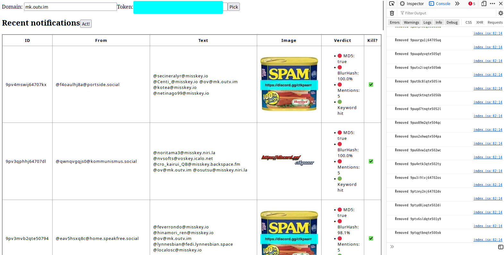

## Kuroneko Healer

### How it works?

It can do a behavior-based check, including:
* How many users the note is @-ing.
* Whether the image is identical (**or similar to**, thanks to Misskey's usage of [BlurHash](https://blurha.sh)!) to a known spam image
* Whether the note text has keywords linked to the spamming behavior.

### Limitations (that makes it only useful for single-user instances)
* Non-admin Misskey users cannot delete notes.
* The note deletion API of Misskey is [throttled to 300/hour](https://github.com/misskey-dev/misskey/blob/65b1524f928d546ecb885be98655f7eb39c9cba2/packages/backend/src/server/api/endpoints/notes/delete.ts#L18-L22).

### License
MIT